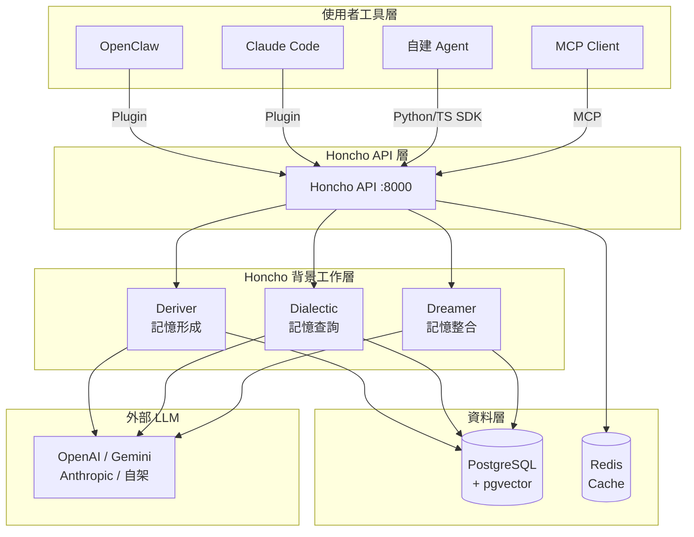

# 00 — 專案地圖（Project Map）

> Honcho 在我的 AI 工作流裡的位置、與其他工具的差異、整合關係圖

---

## Honcho 在我的 AI 工作流裡的位置

```
使用者 ──→ AI Tool (Claude Code / OpenClaw / Chat UI)
                │
                ▼
          Honcho Memory Layer  ←── 記住誰是誰、記住說過什麼、推論心理模型
                │
         ┌──────┼───────┐
         ▼      ▼       ▼
      Deriver Dialectic Dreamer
    (記憶形成)(記憶查詢)(記憶整合)
                │
                ▼
         PostgreSQL (pgvector)
         Redis (cache)
```

Honcho **不是** chatbot，**不是** vector DB，**不是** session store。
它是「讓 AI 理解這個人是誰」的推論引擎，放在你的 AI tool 和 LLM 之間。

---

## Honcho 與其他工具的差異

| 工具 | 定位 | 主要用途 | 差異 |
|------|------|----------|------|
| **Honcho** | AI 記憶基礎設施 | 跨 session 建立使用者心理模型、推論個人化 | 有 Deriver / Dialectic / Dreamer 推論引擎；不只存，還會主動推理 |
| **mem0** | 向量記憶庫 | 存取對話摘要、事實 | Honcho 有更深的推論層（Dreamer 整合）；mem0 更偏向簡單 CRUD |
| **RAG / vector DB** | 文件檢索 | 用 embedding 找相關文件 | RAG 是「找文件」；Honcho 是「理解這個人」，目的不同 |
| **chatbot history** | Session 歷史 | 短期對話上下文 | chatbot history 只存當前對話；Honcho 跨 session 累積長期記憶 |
| **LangMemory / Zep** | 對話記憶 | 摘要 + 向量搜尋 | 類似但 Honcho 有主動 dreaming consolidation 和 peer paradigm |

**關鍵差異**：Honcho 的 Deriver 會自動從對話中萃取「結論（conclusions）」，Dreamer 會週期性整合、推演新知識，Dialectic 回答「這個 user 是什麼樣的人」。這不是純 RAG，是推論式記憶。

---

## Honcho 與 OpenClaw / Claude Code / MCP 的關係

| 工具 | 與 Honcho 的關係 | 整合方式 | 狀態 |
|------|-----------------|----------|------|
| **OpenClaw** | OpenClaw 用 Honcho 當記憶後端 | `@honcho-ai/openclaw-honcho` plugin | ✅ 官方支援，production ready |
| **Claude Code** | Claude Code 用 Honcho Plugin 取得跨 session 記憶 | `/plugin marketplace add plastic-labs/claude-honcho` | ✅ 官方支援，production ready |
| **MCP (通用)** | 任何 MCP-compatible tool 可連 Honcho MCP server | `https://mcp.honcho.dev` 或自架 | ✅ 官方支援 |
| **Comet / Hermes** | 可透過 MCP 或 SDK 整合 | SDK / MCP | 🔍 評估中（見 06-integration） |

---

## Mermaid 架構圖



---

## 核心資源連結

| 資源 | 連結 |
|------|------|
| 官方文件 | https://honcho.dev/docs |
| GitHub (主倉) | https://github.com/plastic-labs/honcho |
| GitHub (OpenClaw) | https://github.com/plastic-labs/openclaw-honcho |
| MCP server | https://mcp.honcho.dev |
| 雲端控制台 | https://app.honcho.dev |
| Discord | https://discord.gg/honcho |
| API Reference | https://honcho.dev/docs/v3/api-reference/introduction |
| llms.txt (文件索引) | https://honcho.dev/docs/llms.txt |
